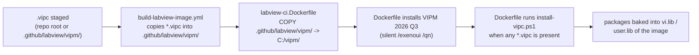

# Baking VIPM (VIPC) dependencies into the Windows CI worker

This folder holds everything the Windows CI worker needs to install **VIPM**
(JKI VI Package Manager) packages into the LabVIEW container image at build time,
so that a project's custom dependencies — declared in a `.vipc` configuration —
are already present when CI jobs (unit tests, VI Analyzer, documentation, …) run.

It exists because some CI operations link against VIPM-distributed libraries that
are **not** part of the bare NI LabVIEW image. The most important example: the
built-in `LabVIEWCLI -OperationName RunUnitTests` operation links against NI's
**UTF JUnit Report** library (`ni_lib_utf_junit_report`). Without it, headless
unit-test runs fail with **LabVIEW CLI error `-350053`** and CI reports a
false "no unit tests found".

---

## Files

| File | Role |
| --- | --- |
| `install-vipc.ps1` | Build-time hook. Finds/installs the VIPM CLI, launches headless LabVIEW, then installs the packages listed in every staged `*.vipc`. Best-effort: it never fails the image build over optional add-ons. |
| `ci-tooling.vipc` | The default CI-tooling configuration (Antidoc CLI, Caraya, VI Tester, UTF JUnit Report). Generated from the two JSON files below. |
| `ci-tooling.packages.json` / `ci-tooling.defaults.json` | Inputs used by `build-tooling-vipc.py` to (re)generate `ci-tooling.vipc`. |
| `build-tooling-vipc.py` | Regenerates `ci-tooling.vipc` from the JSON inputs. |

---

## How a `.vipc` gets baked in (the pipeline)



A repository that "features a `.vipc`" therefore gets that configuration baked
into the Windows worker automatically — the build workflow copies any repo-root
`*.vipc` (e.g. `COTC Dependencies.vipc`) into this folder before building.

To add **custom** project dependencies: commit a `.vipc` (made in the VIPM
editor, or generated like `ci-tooling.vipc`) at the repo root or under
`.github/labview/vipm/`, then rebuild the image. No script changes are needed.

---

## What we learned getting VIPM to run headless in a Windows container

These are the non-obvious requirements. Each one was a distinct failure mode we
hit and fixed; keep them in mind when changing the install path.

### 1. Use VIPM 2026 Q3 (26.3) or newer — not the NI-feed `ni-vipm`

The NI Package Manager feed ships an **older** VIPM (`2026.1.0`) whose CLI cannot
complete a headless package install in a Windows container: its `library_list`
call into LabVIEW times out (~330 s) and the old CLI does **not** surface the
underlying error. The **2026 Q3** build (`26.3.3954`) surfaces underlying install
errors and improves headless/container support.

The Dockerfile now downloads the official installer from the JKI CDN and runs it
silently:

```
https://traffic.libsyn.com/secure/jkinc/vipm-26.3.3954-windows-setup.exe
```

It is a standard InstallShield setup — `/exenoui /qn` runs it fully silent
(per <https://docs.vipm.io/latest/installation/>). Override the URL with the
`VIPM_INSTALLER_URL` build-arg / env var to pin a different version.

### 2. No VIPM Pro license is required — use Community Edition

Confirmed by Jim Kring (VIPM creator): *"the CLI works in the free edition, and
most pro features work in community edition."* The script sets
`VIPM_COMMUNITY_EDITION=1`, so headless installs need **no** activation. (Pro
activation is still attempted automatically if the `VIPM_SERIAL_NUMBER` /
`VIPM_FULL_NAME` / `VIPM_EMAIL` secrets are provided.)

### 3. Run the CLI non-interactively

Set so the CLI never blocks waiting for a prompt and emits clean logs:

- `VIPM_NONINTERACTIVE=1` — auto-confirm; error (don't hang) on missing params.
- `VIPM_ASSUME_YES=1` — explicit "yes" to confirmations.
- `NO_COLOR=1` — no ANSI color codes in CI logs.

### 4. VIPM needs `Settings.ini`

`vipm install` reads `C:\ProgramData\JKI\VIPM\Settings.ini` for its target
LabVIEW configuration and aborts with *"IO error: Failed to load …Settings.ini …
(os error 2)"* if it is missing. A fresh image that never launched VIPM
interactively won't have it, so `install-vipc.ps1` **seeds a minimal
`Settings.ini`** (target name/version/location/VI-Server port `3363`) when it is
absent. The proper installer may also create it; the seed only writes if missing.

### 5. LabVIEW must be running headless before `vipm install`

The modern CLI installs packages **into a running LabVIEW** over VI Server. The
script launches LabVIEW with `--headless` (works on Windows and Linux) and waits
for the VI Server port (`3363`) to accept connections before installing, then
stops it afterward. Without this, the install has nothing to install into.

### 6. Mind the operation timeouts during `docker build`

VIPM auto-detects CI environments (`GITHUB_ACTIONS`, `CI`, …) and uses **longer**
default timeouts there. **But during `docker build` those env vars are not
present**, so VIPM falls back to its **short** defaults
(`check_for_updates` ~270 s, `library_list` ~330 s), which can abort a cold,
first-run headless LabVIEW before it finishes responding.

Fix: set **`VIPM_TIMEOUT`** (seconds) to override the default/CI-adjusted
timeout. The script sets `VIPM_TIMEOUT=900`. See
<https://docs.vipm.io/latest/cli/environment-variables/>.

### 7. CLI command shape (modern Rust/clap CLI)

Verified against `vipm install --help`:

- Install by name with a pinned version using **`@`**:
  `vipm install ni_lib_utf_junit_report@1.0.1.43`
  (the hyphen form `pkg-1.2.3.4` is misread as a file path).
- Useful global options: `--refresh` (update the package list first),
  `--labview-version <YYYY>`, `--labview-bitness <32|64>`,
  `--color-mode auto|always|never`.
- There is **no** `-y` flag and (on `2026.1.0`) **no** standalone `refresh`
  command — non-interactive is controlled by the env vars above, and the package
  list is refreshed via the global `--refresh` option.
- The `config.xml`-only `.vipc` produced by `build-tooling-vipc.py` is **not**
  accepted by `vipm install <file.vipc>` directly, so the script parses the
  package names out of the `.vipc` and installs each **by name**.

---

## Environment variables (read by `install-vipc.ps1` / the Dockerfile)

| Variable | Default | Purpose |
| --- | --- | --- |
| `VIPM_INSTALLER_URL` | `…/vipm-26.3.3954-windows-setup.exe` | VIPM installer to download if the CLI isn't already present. |
| `VIPM_COMMUNITY_EDITION` | `1` | Run without a Pro license. |
| `VIPM_NONINTERACTIVE` | `1` | Never block on prompts. |
| `VIPM_ASSUME_YES` | `1` | Auto-confirm. |
| `VIPM_TIMEOUT` | `900` | Override the per-operation timeout (seconds). |
| `NO_COLOR` | `1` | Strip ANSI color from logs. |
| `LABVIEW_VERSION` | `2026` | Target LabVIEW year for `--labview-version`. |
| `LABVIEW_BITNESS` | `64` | Target LabVIEW bitness for `--labview-bitness`. |
| `VIPM_SERIAL_NUMBER` / `VIPM_FULL_NAME` / `VIPM_EMAIL` | _(unset)_ | Optional VIPM Pro activation. |

---

## Troubleshooting

| Symptom in the build/CI log | Likely cause / fix |
| --- | --- |
| `LabVIEW CLI error -350053` during RunUnitTests | UTF JUnit Report library not baked in — VIPM install was skipped or failed. Check this hook's log. |
| `IO error: Failed to load …Settings.ini … (os error 2)` | VIPM `Settings.ini` missing — the script's seed step didn't run (no LabVIEW found?). |
| `Operation 'VIPM command 'library_list'' timed out after 330s` | Short build-time timeout and/or an old CLI. Use VIPM 26.3+ and raise `VIPM_TIMEOUT`. |
| `error: unexpected argument '-y' found` | Old habit — the modern CLI has no `-y`; use the non-interactive env vars. |
| `no such command: refresh` | Use the global `--refresh` option on `install`, not a standalone `refresh` subcommand. |
| Package install reports "not found" | Package name/version wrong, or the package list wasn't refreshed — keep `--refresh`, verify the `name@version`. |

---

## References

- VIPM CLI docs: <https://docs.vipm.io/latest/cli/>
- Environment variables: <https://docs.vipm.io/latest/cli/environment-variables/>
- Docker / containers: <https://docs.vipm.io/latest/cli/docker/>
- GitHub Actions / CI: <https://docs.vipm.io/latest/cli/github-actions/>
- Installation (Windows installer URLs): <https://docs.vipm.io/latest/installation/>
- Headless LabVIEW: <https://github.com/ni/labview-for-containers/blob/main/docs/headless-labview.md>
